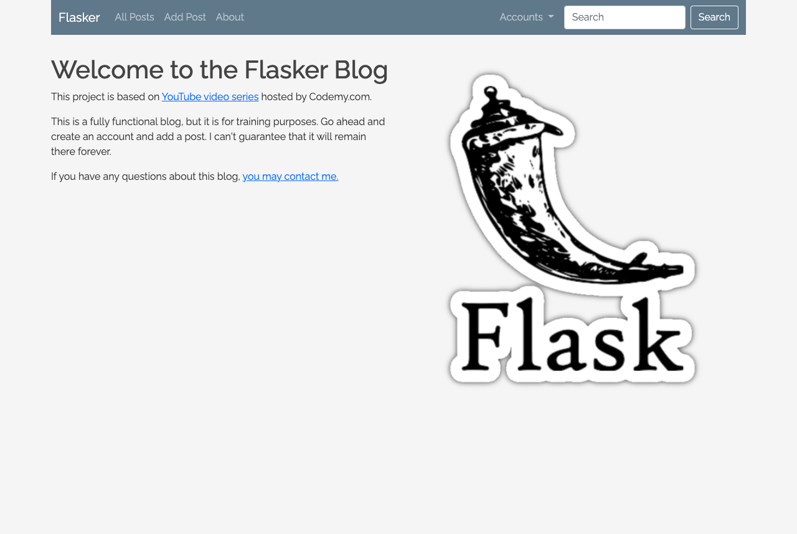

<div id="top"></div>
<!--
*** Thanks for checking out the Best-README-Template. If you have a suggestion
*** that would make this better, please fork the repo and create a pull request
*** or simply open an issue with the tag "enhancement".
*** Thanks again! Now go create something AMAZING! :D
***
***
***
*** To avoid retyping too much info. Do a search and replace for the following:
*** drobb2020, flasker, davidrobb2, drobb2011@gmail.com, Python Flask Blog Application, A flask application based on a tutorial from Codemy.com
-->

<!-- PROJECT SHIELDS -->
<!--
*** I'm using markdown "reference style" links for readability.
*** Reference links are enclosed in brackets [ ] instead of parentheses ( ).
*** See the bottom of this document for the declaration of the reference variables
*** for contributors-url, forks-url, etc. This is an optional, concise syntax you may use.
*** https://www.markdownguide.org/basic-syntax/#reference-style-links
-->
[![Contributors][contributors-shield]][contributors-url]
[![Forks][forks-shield]][forks-url]
[![Stargazers][stars-shield]][stars-url]
[![Issues][issues-shield]][issues-url]
[![MIT License][license-shield]][license-url]
[![LinkedIn][linkedin-shield]][linkedin-url]

<!-- PROJECT LOGO -->
<br />
<p align="center">
  <a href="https://github.com/drobb2020/flasker">
    
  </a>

  <h3 align="center">Python Flask Blog Application</h3>

  <p align="center">
    A flask application based on a tutorial from Codemy.com
    <br />
    <a href="https://github.com/drobb2020/flasker"><strong>Explore the docs »</strong></a>
    <br />
    <br />
    <a href="https://flaskerdrobb.herokuapp.com/">View Demo</a>
    ·
    <a href="https://github.com/drobb2020/flasker/issues">Report Bug</a>
    ·
    <a href="https://github.com/drobb2020/flasker/issues">Request Feature</a>
  </p>
</p>

<!-- TABLE OF CONTENTS -->
<details open="open">
  <summary><h2 style="display: inline-block">Table of Contents</h2></summary>
  <ol>
    <li>
      <a href="#about-the-project">About The Project</a>
      <ul>
        <li><a href="#built-with">Built With</a></li>
      </ul>
    </li>
    <li>
      <a href="#getting-started">Getting Started</a>
      <ul>
        <li><a href="#prerequisites">Prerequisites</a></li>
        <li><a href="#installation">Installation</a></li>
      </ul>
    </li>
    <li><a href="#usage">Usage</a></li>
    <li><a href="#roadmap">Roadmap</a></li>
    <li><a href="#contributing">Contributing</a></li>
    <li><a href="#license">License</a></li>
    <li><a href="#contact">Contact</a></li>
    <li><a href="#acknowledgements">Acknowledgements</a></li>
  </ol>
</details>

<p align="right">(<a href="#top">back to top</a>)</p>

<!-- ABOUT THE PROJECT -->
## About The Project

<a href="https://github.com/drobb2020/flasker">
    
  </a>

Python Flask Blog Application
A flask application based on a tutorial from Codemy.com (Flask Friday's)

<p align="right">(<a href="#top">back to top</a>)</p>

### Built With

* [Python](https://www.python.org/)
* [Flask](https://flask.palletsprojects.com/en/2.0.x/)
* [VSCode](https://code.visualstudio.com/)
* [Bootstrap 5](https://getbootstrap.com/)

<p align="right">(<a href="#top">back to top</a>)</p>

<!-- GETTING STARTED -->
## Getting Started

To get a local copy up and running follow these simple steps.

<p align="right">(<a href="#top">back to top</a>)</p>

### Prerequisites

You will need a version of Python installed greater than 3.6. You can run this on Windows, MacOS, or Linux. My project was created on a Mac, and the following installation commands are valid on a Mac, but are different on Windows!

<p align="right">(<a href="#top">back to top</a>)</p>

### Installation

1. Clone the repo

   ```sh
   git clone https://github.com/drobb2020/flasker.git
   ```

2. Change into the cloned directory

   ```sh
   cd flasker
   ```

3. Create a virtual environment and activate it

   ```sh
   python3 -m virtualenv venv
   source venv/bin/activate
   ```

4. Install the necessary requirements for the Project

   ```sh
   pip install -r requirements.txt
   ```

5. Set the following environment variables

   ```sh
   export FLASK_ENV=development
   export FLASK_APP=app.py
   ```

6. Run the application

   ```sh
   flask run
   ```

Happy coding!

<p align="right">(<a href="#top">back to top</a>)</p>

<!-- USAGE EXAMPLES -->
## Usage

This is primarily for learning and honing my flask skills. I hope you enjoy learning flask as much as I do.

<p align="right">(<a href="#top">back to top</a>)</p>

<!-- ROADMAP -->
## Roadmap

* [X] Add Changelog
* [X] Add back to top links
* [X] Add Support contact information
* [ ] Add a custom image for each blog post

See the [open issues](https://github.com/drobb2020/flasker/issues) for a list of proposed features (and known issues).

<p align="right">(<a href="#top">back to top</a>)</p>

<!-- CONTRIBUTING -->
## Contributing

Contributions are what make the open source community such an amazing place to be learn, inspire, and create. Any contributions you make are **greatly appreciated**.

1. Fork the Project
2. Create your Feature Branch (`git checkout -b feature/AmazingFeature`)
3. Commit your Changes (`git commit -m 'Add some AmazingFeature'`)
4. Push to the Branch (`git push origin feature/AmazingFeature`)
5. Open a Pull Request

<p align="right">(<a href="#top">back to top</a>)</p>

<!-- LICENSE -->
## License

Distributed under the MIT License. See `LICENSE` for more information.

<p align="right">(<a href="#top">back to top</a>)</p>

<!-- CONTACT -->
## Contact

Your Name - [@davidrobb2](https://twitter.com/davidrobb2) - drobb2011@gmail.com

Project Link: [https://github.com/drobb2020/flasker](https://github.com/drobb2020/flasker)

<p align="right">(<a href="#top">back to top</a>)</p>

<!-- ACKNOWLEDGEMENTS -->
## Acknowledgements

* [John Elder @ codemy.com](https://www.youtube.com/playlist?list=PLCC34OHNcOtolz2Vd9ZSeSXWc8Bq23yEz)

<p align="right">(<a href="#top">back to top</a>)</p>

<!-- MARKDOWN LINKS & IMAGES -->
<!-- https://www.markdownguide.org/basic-syntax/#reference-style-links -->
[contributors-shield]: https://img.shields.io/github/contributors/drobb2020/flasker.svg?style=for-the-badge
[contributors-url]: https://github.com/drobb2020/flasker/graphs/contributors
[forks-shield]: https://img.shields.io/github/forks/drobb2020/flasker.svg?style=for-the-badge
[forks-url]: https://github.com/drobb2020/flasker/network/members
[stars-shield]: https://img.shields.io/github/stars/drobb2020/flasker.svg?style=for-the-badge
[stars-url]: https://github.com/drobb2020/flasker/stargazers
[issues-shield]: https://img.shields.io/github/issues/drobb2020/flasker.svg?style=for-the-badge
[issues-url]: https://github.com/drobb2020/flasker/issues
[license-shield]: https://img.shields.io/github/license/drobb2020/flasker.svg?style=for-the-badge
[license-url]: https://github.com/drobb2020/flasker/blob/master/LICENSE
[linkedin-shield]: https://img.shields.io/badge/-LinkedIn-black.svg?style=for-the-badge&logo=linkedin&colorB=555
[linkedin-url]: https://linkedin.com/in/drobb2020
